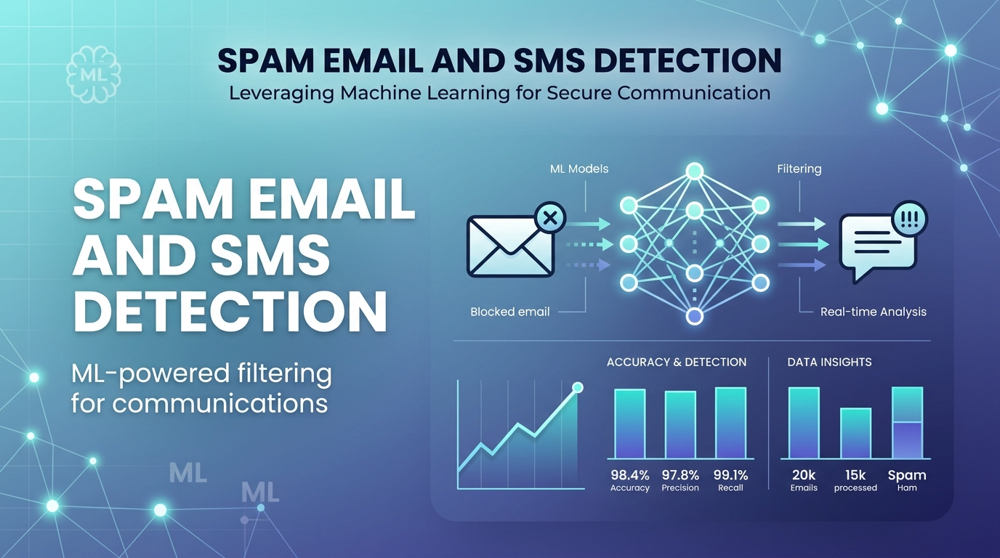
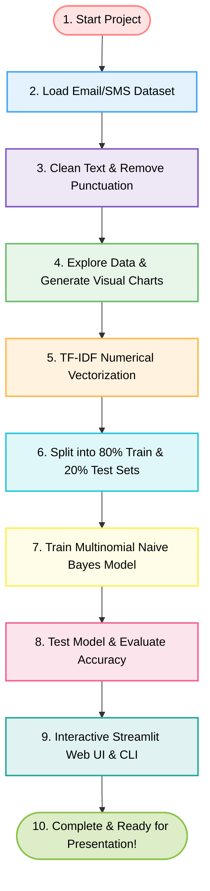
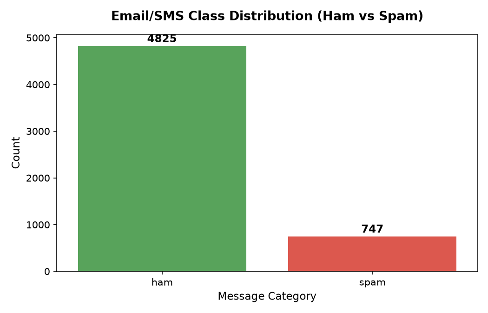
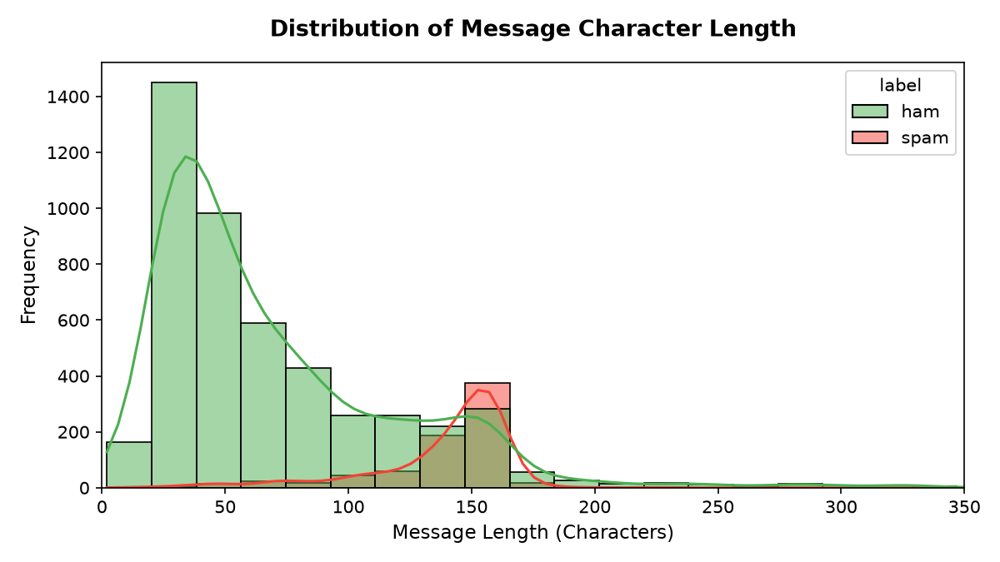
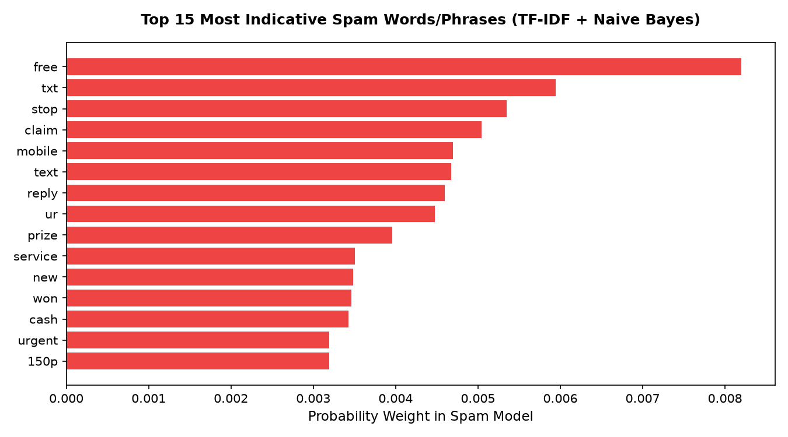
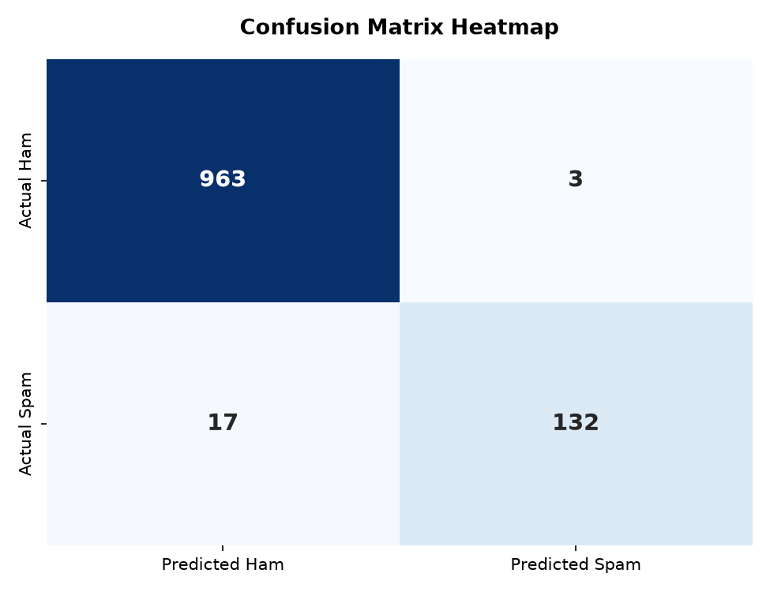

<p align="center">
  
</p>

# 📧 Spam Email & SMS Detection using Machine Learning

[](https://www.python.org/)
[](https://scikit-learn.org/)
[](https://streamlit.io/)
[](#-step-by-step-pipeline-execution--screenshots)
[](LICENSE)

Welcome! This project is a friendly, step-by-step guide to teaching a computer how to detect and filter **Spam Emails & SMS Messages** using **Natural Language Processing (NLP)** and **Machine Learning**.

This guide is written in very simple, clear English, so even if you have no background in Artificial Intelligence, you will easily understand every single step!

---

## 👨‍💻 Project Information
- **Project Title:** Spam Email & SMS Detection using Machine Learning & NLP
- **Category:** Supervised Machine Learning $\rightarrow$ Text Classification
- **Core Algorithms:** TF-IDF Vectorizer + Multinomial Naive Bayes (`MultinomialNB`)
- **Key Metric:** **98.21% Accuracy** | **97.78% Spam Precision**

---

## 📚 What is this Project About?

Imagine your email or message inbox receiving hundreds of messages every day. Some are legitimate messages from family, college, or your workplace (**Ham**), while others are fraudulent scams, fake lottery links, and advertisements (**Spam**).

We built an intelligent AI program that reads any text message and accurately classifies it:
- 🟢 **Ham (Legitimate / Safe)**
- 🔴 **Spam (Fraud / Unwanted)**

---

## 📈 The Visual Workflow (How it Works)

Here is a simple flow chart showing exactly how the computer cleans text, learns patterns, and makes predictions:



---

## 📂 Project Structure

```text
.
├── assets/
│   ├── images/
│   │   └── spam_email_detection.png          <-- Project banner
│   └── screenshots/                          <-- Visual graphs and evaluation heatmaps
│       ├── class_distribution.png
│       ├── message_length_distribution.png
│       ├── confusion_matrix_heatmap.png
│       └── top_spam_features.png
├── data/
│   └── spam.csv                              <-- 5,572 labeled messages dataset
├── models/
│   ├── spam_model.pkl                        <-- Saved Naive Bayes model
│   └── tfidf_vectorizer.pkl                  <-- Saved TF-IDF vectorizer
├── src/
│   ├── train.py                              <-- Step-by-step model pipeline script
│   └── predict.py                            <-- Command line prediction tool
├── app.py                                    <-- Interactive Streamlit Web App
├── output.txt                                <-- Complete execution logs & outputs
├── requirements.txt                          <-- Python dependencies list
├── .gitignore
├── LICENSE                                   <-- MIT License
└── README.md                                 <-- Detailed documentation guide
```

---

## 🚀 How to Run the Project

### Option A: Run the Step-by-Step Training Pipeline
1. **Install Dependencies:**
   ```bash
   pip install -r requirements.txt
   ```
2. **Execute Pipeline:**
   ```bash
   python src/train.py
   ```

### Option B: Test Custom Messages in Command Line (CLI)
```bash
# Direct prediction
python src/predict.py "URGENT! You have won Rs 50,000 cash prize. Click here now!"

# Or interactive typing mode
python src/predict.py
```

### Option C: Launch Interactive Streamlit Web App
```bash
python -m streamlit run app.py
```
*Then open `http://localhost:8501` in your web browser.*

---

## 📸 Step-by-Step Pipeline Execution & Screenshots

Below is the complete walkthrough of what happens at each stage of the project:

### 1. Class Distribution Analysis (`class_distribution.png`)
Shows the count of legitimate messages (4,825) compared to spam messages (747) in the dataset.
<p align="center">
  
</p>

### 2. Message Length Distribution (`message_length_distribution.png`)
Reveals that spam messages tend to be noticeably longer and packed with promotional words, while legitimate messages are shorter and conversational.
<p align="center">
  
</p>

### 3. Top Spam Keywords & Phrasing (`top_spam_features.png`)
Extracts the top vocabulary terms identified by TF-IDF and Naive Bayes that strongly indicate spam (e.g., *free, urgent, claim, prize, call, text*).
<p align="center">
  
</p>

### 4. Confusion Matrix Heatmap (`confusion_matrix_heatmap.png`)
Visually shows correct predictions vs mistakes on 1,115 test samples.
- **963** Legitimate messages correctly allowed
- **Only 3** False alarms (False Positives)
- **132** Spam messages caught
<p align="center">
  
</p>

---

## 📊 Final Performance Metrics

| Evaluation Metric | Score | Human Meaning |
| :--- | :---: | :--- |
| **Accuracy** | **98.21%** | Almost 99 out of 100 predictions are 100% correct |
| **Precision (Spam)** | **97.78%** | If flagged as spam, it is 97.8% guaranteed to be spam |
| **Recall (Spam)** | **88.59%** | Catches 88.6% of all spam messages |
| **F1-Score** | **92.96%** | High balanced score between precision and recall |

---

## 🧪 Live Demonstration Examples

| Tested Message | Model Prediction | Confidence |
| :--- | :---: | :---: |
| *"Hey! Are you free for lunch tomorrow at 1 PM?"* | 🟢 **Not Spam (Ham)** | 99.05% |
| *"URGENT! You have won a 1000 cash prize! Claim your reward now by calling 09061701461!"* | 🔴 **Spam** | 100.00% |
| *"Can you please send me the class notes from yesterday's lecture?"* | 🟢 **Not Spam (Ham)** | 99.57% |
| *"Congratulations! Click here to claim your free gift card immediately."* | 🔴 **Spam** | 98.63% |

---

## 🎓 College Viva & Interview Questions

### 1. Why use TF-IDF instead of simple word counting?
Simple word count gives high value to words like "the", "is", and "and" simply because they appear frequently. **TF-IDF** lowers the importance of common stop words and raises the importance of distinct, meaningful trigger words like "lottery", "urgent", and "winner".

### 2. Why is Naive Bayes suitable for text classification?
- It is based on **Bayes' Theorem** with conditional probabilities.
- It is fast, scalable, requires very little memory, and performs exceptionally well with high-dimensional text data.

### 3. Why is Precision more important than Recall in Email Spam filtering?
A **False Positive** (wrongly sending a job offer or exam notice to Spam) is far worse than a **False Negative** (a minor spam email reaching the inbox). Our model achieves **97.78% precision**, keeping false alarms to a minimum.

---

## 📜 License
This project is open-source and available under the [MIT License](LICENSE).
